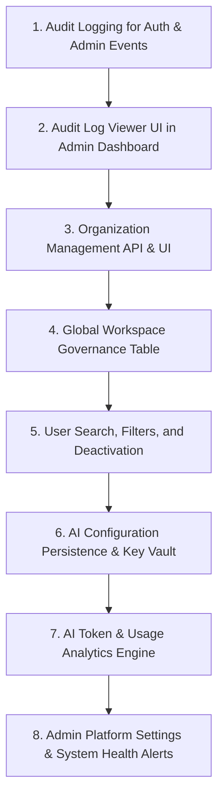

# Admin Feature Implementation Audit

**Product:** RootForge (AI Solution Builder)  
**Audit Type:** Enterprise Platform Architecture, Security, RBAC & Admin Implementation Verification  
**Auditor:** Senior Enterprise Product Architect, Admin Platform Architect, QA & Security Auditor  
**Date:** September 2026  
**Status:** Read-Only Technical Audit (No Code Modified)

---

## 1. Executive Summary

A comprehensive architectural and functional audit of the RootForge ("AI Solution Builder") codebase was conducted to determine the exact implementation status of all Admin Platform features. Every functional flow was traced end-to-end across **Frontend (Vite/React)**, **Backend (Express/Node.js)**, **Database (Prisma ORM / PostgreSQL)**, and **Authorization & Multi-Tenancy Layers**.

### Audit Classification Totals

| Classification | Count | Description |
|---|:---:|---|
| **[IMPLEMENTED]** | **7** | Full functional flow exists: UI $\rightarrow$ State $\rightarrow$ API $\rightarrow$ Backend Logic $\rightarrow$ Database Persistence $\rightarrow$ RBAC/Tenant Isolation. |
| **[PARTIAL]** | **12** | Core schema or backend route exists, but lacks key functionality, UI controls, filtering, or full lifecycle operations. |
| **[UI ONLY]** | **3** | Visual interface exists in the frontend, but inputs are disconnected from backend persistence (e.g. settings saved in local toast only). |
| **[BACKEND ONLY]** | **8** | Database models, services, or API endpoints exist, but have no corresponding Admin interface. |
| **[MISSING]** | **24** | Required enterprise capability has no database model, API endpoint, or UI component. |
| **[UNKNOWN]** | **0** | All inspected features have been definitively verified against codebase evidence. |
| **TOTAL AUDITED** | **54** | Comprehensive specification requirements. |

---

## 2. Admin Feature Matrix

| Category | Feature | Status | Frontend | Backend/API | Database | Security/RBAC | Evidence (Code References) | Missing Pieces |
|---|---|:---:|---|---|---|---|---|---|
| **A. User Mgmt** | User Listing | `[IMPLEMENTED]` | `AdminDashboardPage.jsx` | `GET /api/admin/users` | `User`, `Organization` | `requireRole('ADMIN')` | [admin.routes.js:69-89](file:///Users/JBC/Documents/Projects/rootforge%202/backend/src/routes/admin.routes.js#L69-L89), [AdminDashboardPage.jsx:173-219](file:///Users/JBC/Documents/Projects/rootforge%202/frontend/src/pages/admin/AdminDashboardPage.jsx#L173-L219) | Search, pagination, filter by org/role |
| **A. User Mgmt** | User Provisioning | `[IMPLEMENTED]` | Modal Form | `POST /api/admin/users` | `User.create` | `requireRole('ADMIN')` | [admin.routes.js:92-135](file:///Users/JBC/Documents/Projects/rootforge%202/backend/src/routes/admin.routes.js#L92-L135), [AdminDashboardPage.jsx:221-293](file:///Users/JBC/Documents/Projects/rootforge%202/frontend/src/pages/admin/AdminDashboardPage.jsx#L221-L293) | Welcome email trigger, password complexity policy |
| **A. User Mgmt** | Role Modification | `[IMPLEMENTED]` | Dropdown Select | `PATCH /api/admin/users/:userId` | `User.update` | `requireRole('ADMIN')` | [admin.routes.js:138-152](file:///Users/JBC/Documents/Projects/rootforge%202/backend/src/routes/admin.routes.js#L138-L152), [AdminDashboardPage.jsx:58-66](file:///Users/JBC/Documents/Projects/rootforge%202/frontend/src/pages/admin/AdminDashboardPage.jsx#L58-L66) | Confirmation dialog, privilege demotion guard |
| **A. User Mgmt** | User Search & Filtering | `[MISSING]` | None | None | None | None | No search input or query params in `AdminDashboardPage.jsx` | Client/server search, role filter, org filter |
| **A. User Mgmt** | User Deactivation / Deletion | `[MISSING]` | None | None | `User` (no isActive field) | None | No `DELETE` or `PATCH status` endpoint | Soft delete / `isActive` flag, deactivation endpoint |
| **A. User Mgmt** | User Activity Trail | `[BACKEND ONLY]` | None | `ActivityLog` queries | `ActivityLog` table | Scoped by workspace | [schema.prisma:469-490](file:///Users/JBC/Documents/Projects/rootforge%202/backend/prisma/schema.prisma#L469-L490) | User-specific activity drilldown UI |
| **B. Org Mgmt** | Org Count Metric | `[IMPLEMENTED]` | Metric Card | `GET /api/admin/metrics` | `prisma.organization.count()` | `requireRole('ADMIN')` | [admin.routes.js:15-49](file:///Users/JBC/Documents/Projects/rootforge%202/backend/src/routes/admin.routes.js#L15-L49), [AdminDashboardPage.jsx:108](file:///Users/JBC/Documents/Projects/rootforge%202/frontend/src/pages/admin/AdminDashboardPage.jsx#L108) | Detailed organization drilldown |
| **B. Org Mgmt** | Org Directory & Profiles | `[MISSING]` | None | None | `Organization` model | None | No `/api/admin/organizations` endpoint | List, edit, profile view, industry settings |
| **B. Org Mgmt** | Org Workspaces & Projects | `[BACKEND ONLY]` | None | `Workspace.organizationId` | `Organization.workspaces` | Admin can query | [schema.prisma:18](file:///Users/JBC/Documents/Projects/rootforge%202/backend/prisma/schema.prisma#L18) | Admin view of workspaces per organization |
| **B. Org Mgmt** | Org Security & AI Config | `[MISSING]` | None | None | None | None | No Org config columns or tables | Org-level LLM keys, SAML/SSO configs |
| **C. Workspace Mgmt** | Workspace Metric Count | `[IMPLEMENTED]` | Metric Card | `GET /api/admin/metrics` | `prisma.workspace.count()` | `requireRole('ADMIN')` | [admin.routes.js:18](file:///Users/JBC/Documents/Projects/rootforge%202/backend/src/routes/admin.routes.js#L18) | Full table view in Admin console |
| **C. Workspace Mgmt** | Global Workspace Governance | `[BACKEND ONLY]` | None | `GET /api/workspaces` (Admin gets all) | `Workspace` table | `getTenantWorkspaceWhere` allows ADMIN | [authorization.service.js:25-27](file:///Users/JBC/Documents/Projects/rootforge%202/backend/src/services/authorization.service.js#L25-L27) | Admin UI table to view, reassign, delete workspaces |
| **C. Workspace Mgmt** | Workspace Member Assignment | `[MISSING]` | None | None | None | None | Workspaces only link to single `createdById` and `organizationId` | Multi-user workspace membership junction table |
| **D. Project Mgmt** | Project Entity Management | `[PARTIAL]` | Handled as Workspaces | `/api/workspaces` | `Workspace` | Scoped to Org | [workspace.routes.js:198-233](file:///Users/JBC/Documents/Projects/rootforge%202/backend/src/routes/workspace.routes.js#L198-L233) | Sub-project hierarchy under workspaces |
| **E. RBAC** | Role Assignment | `[IMPLEMENTED]` | Dropdown | `PATCH /api/admin/users/:userId` | `User.role` string | `ADMIN` role required | [admin.routes.js:138-152](file:///Users/JBC/Documents/Projects/rootforge%202/backend/src/routes/admin.routes.js#L138-L152) | Custom roles, dynamic permissions |
| **E. RBAC** | Role Enforcement (Backend) | `[IMPLEMENTED]` | Route guards | `requireRole`, `assertWorkspaceWriteAccess` | `User.role` | Enforced in middleware | [auth.js:54-66](file:///Users/JBC/Documents/Projects/rootforge%202/backend/src/middleware/auth.js#L54-L66), [authorization.service.js:79-96](file:///Users/JBC/Documents/Projects/rootforge%202/backend/src/services/authorization.service.js#L79-L96) | Granular permission checking matrix |
| **E. RBAC** | Granular Permission Tables | `[MISSING]` | None | None | None | None | Roles are hardcoded strings in code | `Role`, `Permission`, `RolePermission` tables |
| **F. AI Model Mgmt** | AI Provider Telemetry | `[PARTIAL]` | System Health Card | `GET /api/health/ai`, `GET /api/admin/ai/health` | None (Environment) | `requireRole('ADMIN')` | [server.js:154-189](file:///Users/JBC/Documents/Projects/rootforge%202/backend/src/server.js#L154-L189), [admin.routes.js:56-66](file:///Users/JBC/Documents/Projects/rootforge%202/backend/src/routes/admin.routes.js#L56-L66) | Dynamic model switcher, model limits |
| **F. AI Model Mgmt** | AI Config Persistence | `[UI ONLY]` | `SettingsPage.jsx` | None | None | None | [SettingsPage.jsx:31-34](file:///Users/JBC/Documents/Projects/rootforge%202/frontend/src/pages/settings/SettingsPage.jsx#L31-L34) (shows toast only) | Backend persistence endpoint, encrypted storage |
| **F. AI Model Mgmt** | Model Activation/Limits | `[MISSING]` | None | None | None | None | No limit configuration | Model throttling, token quotas per model |
| **G. AI Usage** | Token Counter | `[PARTIAL]` | None | `increment: tokensUsed` | `Workspace.aiTokensUsed` | Workspace scoped | [analysis.routes.js:84](file:///Users/JBC/Documents/Projects/rootforge%202/backend/src/routes/analysis.routes.js#L84), [schema.prisma:92](file:///Users/JBC/Documents/Projects/rootforge%202/backend/prisma/schema.prisma#L92) | Admin token aggregation UI, user-level token log |
| **G. AI Usage** | AI Request Logs & Errors | `[MISSING]` | None | Console logging only | None | None | [server.js:98-117](file:///Users/JBC/Documents/Projects/rootforge%202/backend/src/server.js#L98-L117) | `AiRequestLog` table (tokens, latency, prompt version) |
| **G. AI Usage** | Quotas & Usage Alerts | `[MISSING]` | None | None | None | None | No quota enforcement logic | Quota limits, warning alerts at 80%/100% |
| **H. Org Analytics** | Organization AI Consumption | `[MISSING]` | None | None | `Workspace.aiTokensUsed` | None | No aggregation query grouped by org | Grouped query `SUM(aiTokensUsed) GROUP BY orgId` |
| **I. Model Analytics**| Model Success/Latency Trends | `[MISSING]` | None | None | None | None | No latency persistence | Latency histogram, failure rate tracking |
| **J. Security Policy**| Password & OTP Policy | `[PARTIAL]` | Login/Register UI | `otpService.js` | `EmailVerificationOTP` | Enforced at auth | [auth.routes.js:126-174](file:///Users/JBC/Documents/Projects/rootforge%202/backend/src/routes/auth.routes.js#L126-L174) | Admin-configurable policy controls |
| **J. Security Policy**| Session Policy / Expiration | `[PARTIAL]` | JWT storage | `auth.js:69` (7d expiry) | None (Stateless) | Bearer JWT | [auth.js:69](file:///Users/JBC/Documents/Projects/rootforge%202/backend/src/middleware/auth.js#L69) | Token revocation list, inactivity timeout |
| **K. Audit Logs** | Activity Logging Engine | `[BACKEND ONLY]` | None | `ActivityLog.create` | `ActivityLog` table | Logged on events | [schema.prisma:469-490](file:///Users/JBC/Documents/Projects/rootforge%202/backend/prisma/schema.prisma#L469-L490) | Admin log viewer UI with search & filters |
| **K. Audit Logs** | Admin Activity / Auth Audit | `[MISSING]` | None | None | `ActivityLog` lacks auth events | None | Logins, failed passwords, role changes not logged |
| **L. System Health** | Live System Telemetry | `[IMPLEMENTED]` | Telemetry Grid | `GET /api/admin/metrics` | None (Runtime) | `requireRole('ADMIN')` | [admin.routes.js:24-32](file:///Users/JBC/Documents/Projects/rootforge%202/backend/src/routes/admin.routes.js#L24-L32), [AdminDashboardPage.jsx:130-165](file:///Users/JBC/Documents/Projects/rootforge%202/frontend/src/pages/admin/AdminDashboardPage.jsx#L130-L165) | Dynamic DB connectivity check in UI |
| **L. System Health** | Incident / Error Dashboard | `[MISSING]` | None | None | None | None | Errors only logged to stdout | Centralized incident logging & alerts |
| **M. Performance** | Request Latency Tracking | `[PARTIAL]` | None | Middleware console log | None | None | [server.js:98-117](file:///Users/JBC/Documents/Projects/rootforge%202/backend/src/server.js#L98-L117) | Telemetry store & p95/p99 chart UI |
| **N. Integrations** | Enterprise Integration Mgmt | `[MISSING]` | None | None | None | None | No integration schema or routes | Jira, GitHub, Slack, Azure DevOps connectors |
| **O. Compliance** | Security Compliance Dashboard| `[MISSING]` | None | None | None | None | No compliance audit models | SOC2/ISO27001 compliance checklist & tracking |
| **P. Notifications**| User Notifications | `[BACKEND ONLY]` | None | `Notification` model | `Notification` table | Scoped to user | [schema.prisma:524-535](file:///Users/JBC/Documents/Projects/rootforge%202/backend/prisma/schema.prisma#L524-L535) | Admin system broadcast UI |
| **Q. Dashboard** | Central Admin Console | `[IMPLEMENTED]` | `AdminDashboardPage.jsx` | `GET /api/admin/metrics` | Multiple tables | `AdminRoute` guard | [AdminDashboardPage.jsx:1-297](file:///Users/JBC/Documents/Projects/rootforge%202/frontend/src/pages/admin/AdminDashboardPage.jsx#L1-L297), [App.jsx:73-83](file:///Users/JBC/Documents/Projects/rootforge%202/frontend/src/App.jsx#L73-L83) | Activity logs table, org analytics tab |
| **R. Multi-Tenancy** | Organization Isolation | `[IMPLEMENTED]` | Scoped views | `authorization.service.js` | `organizationId` foreign keys | Safe 404 on foreign orgs | [authorization.service.js:19-39](file:///Users/JBC/Documents/Projects/rootforge%202/backend/src/services/authorization.service.js#L19-L39), [authorization.service.js:79-87](file:///Users/JBC/Documents/Projects/rootforge%202/backend/src/services/authorization.service.js#L79-L87) | Workspace transfer between tenants |
| **S. Authentication**| Two-Factor Email OTP Login | `[IMPLEMENTED]` | `LoginPage.jsx`, `VerifyEmailPage.jsx` | `auth.routes.js`, `otpService.js` | `EmailVerificationOTP` | Hash comparison, rate limit | [auth.routes.js:126-217](file:///Users/JBC/Documents/Projects/rootforge%202/backend/src/routes/auth.routes.js#L126-L217) | Backup recovery codes |
| **T. Admin Settings**| Gateway & Theme Settings | `[PARTIAL]` | `SettingsPage.jsx` | Local storage | None | Client-side only | [SettingsPage.jsx:108-301](file:///Users/JBC/Documents/Projects/rootforge%202/frontend/src/pages/settings/SettingsPage.jsx#L108-L301) | Global platform config table in database |

---

## 3. User Management Audit

### Implemented Functionality:
1. **User Listing (`GET /api/admin/users`)**: Returns all users ordered by creation date with their associated organization name, email, role, and registration date.
2. **User Creation (`POST /api/admin/users`)**: Platform admins can provision users directly with custom roles and organizations. Hashes passwords using `bcrypt.hash(password, 10)`.
3. **Role Updating (`PATCH /api/admin/users/:userId`)**: Admins can change user roles dynamically across `ADMIN`, `CONSULTANT`, `ANALYST`, and `VIEWER`. Changes take immediate effect because `authenticate` middleware re-reads `User.role` from the database on every authenticated request.

### Deficiencies & Missing Capabilities:
- **No Search or Filtering:** `AdminDashboardPage.jsx` renders all users in a single table without client or server search, pagination, or role filtering.
- **No User Deactivation / Soft Deletion:** There is no `isActive` or `status` column in `User`. Deleting or disabling an employee account is impossible through the Admin UI.
- **No User Detail Inspector:** Clicking on a user row does nothing; cannot inspect workspaces created, documents uploaded, or last login timestamp.
- **No Password Reset from Admin:** Admins cannot trigger a password reset for a locked-out user.

---

## 4. Organization Management Audit

### Current Status: `[PARTIAL / BACKEND ONLY]`
- **Database Schema:** `Organization` model exists in `schema.prisma` (`id`, `name`, `industry`, `createdAt`, `updatedAt`).
- **Backend Support:** `prisma.organization.count()` is returned via `GET /api/admin/metrics`. Organizations are auto-created if a name is passed during user registration or workspace creation.
- **Gaps:** 
  - There is NO Organization Management page or sub-tab in the Admin Console.
  - There are NO CRUD endpoints for organizations (`GET /api/admin/organizations`, `PATCH /api/admin/organizations/:id`, `DELETE /api/admin/organizations/:id`).
  - Admins cannot view which users or workspaces belong to an organization, nor set organization-specific quotas or policies.

---

## 5. Workspace Management Audit

### Current Status: `[PARTIAL / BACKEND ONLY]`
- **Database Schema:** `Workspace` model contains `id`, `name`, `organizationId`, `industry`, `objective`, `challenge`, `status`, `createdById`, `aiTokensUsed`.
- **Tenant Scoping:** `authorization.service.js` strictly isolates workspaces by `organizationId` and `createdById`. Platform admins have global visibility (`getTenantWorkspaceWhere` returns `{}` for `ADMIN`).
- **Gaps:**
  - The Admin UI (`AdminDashboardPage.jsx`) only displays a single metric card ("Transformation Workspaces: X").
  - There is no table of all workspaces in the Admin Dashboard to allow admins to inspect status, change owners, archive inactive workspaces, or audit workspace size.
  - There is no multi-user workspace membership model (workspaces are owned by creator + organization).

---

## 6. Project Management Audit

### Current Status: `[PARTIAL]`
- In RootForge, **Workspaces represent Transformation Projects**. All architectural artifacts (Analysis, Solution, Architecture Nodes/Edges, Process Nodes, Wireframes, ERD, API specs, Sprint Plans) are children of `Workspace`.
- **Gaps:** There is no distinct "Project" entity underneath a Workspace. An Admin cannot organize workspaces into portfolios or programs.

---

## 7. RBAC & Permissions Audit

### Implemented Authorization Rules:
1. **Frontend Route Protection:** `AdminRoute` in `frontend/src/App.jsx:73-83` verifies `user.role === 'ADMIN'`. Non-admins are immediately redirected to `/app/workspaces`.
2. **Backend Route Protection:** `requireRole('ADMIN')` in `backend/src/middleware/auth.js:54-66` protects all `/api/admin/*` routes with HTTP 403.
3. **Authoritative DB Role Validation:** `authenticate` middleware in `backend/src/middleware/auth.js:18-42` queries the database on every request to fetch the live user role, preventing stale JWT privilege escalation.
4. **Viewer Role Write Restrictions:** `assertWorkspaceWriteAccess` in `backend/src/services/authorization.service.js:110-112` blocks `VIEWER` roles from mutating artifacts or creating workspaces.

### Deficiencies & Missing Capabilities:
- Roles are hardcoded string constants (`ADMIN`, `CONSULTANT`, `ANALYST`, `VIEWER`).
- There are no database tables for `Role`, `Permission`, or `UserPermission`. Custom roles (e.g. "Security Auditor", "External Architect") cannot be defined.

---

## 8. AI Model Management Audit

### Current Status: `[PARTIAL / UI ONLY]`
- **Backend Architecture:** `aiService.js` and `providerRouter.js` support switching between `demoProvider` (deterministic rules engine) and `externalProvider` (Google Gemini / OpenAI / Anthropic).
- **Health Telemetry:** `GET /api/health/ai` and `GET /api/admin/ai/health` ping the configured LLM and report provider status without leaking secrets.
- **Critical Flaw in Frontend Settings (`SettingsPage.jsx:31-34`):**
  ```javascript
  const handleSaveAIConfig = (e) => {
    e.preventDefault();
    showToast('AI Provider preferences saved locally.');
  };
  ```
  The AI Provider configuration form in `SettingsPage.jsx` does **NOT** call any backend API. Provider selections, API keys, and model names typed into this form are discarded on page refresh.

---

## 9. AI Usage Monitoring Audit

### Current Status: `[PARTIAL / BACKEND ONLY]`
- **Token Tracking:** When an artifact is generated (Analysis, Solution, Architecture, UX, Database, APIs, Planning), `_meta.tokensUsed` is calculated and incremented on `Workspace.aiTokensUsed` (`backend/src/routes/*.routes.js`).
- **Gaps:**
  - Token consumption is NOT tracked per user, per organization, or per model over time.
  - There is no `AiUsageLog` or `AiRequestLog` table recording request timestamps, prompt versions, tokens, latency, or costs.
  - The Admin UI does NOT display total tokens used or consumption graphs.

---

## 10. AI Model Analytics Audit

### Current Status: `[MISSING]`
- No latency histograms, error rates, model comparison benchmarks, or cost estimation calculations are stored or visualized in the Admin console.

---

## 11. Security Policy Audit

### Current Status: `[PARTIAL]`
- **Enforced Security Mechanisms:**
  - Passwords hashed with `bcryptjs` (salt rounds: 10).
  - Mandatory 6-digit Email OTP on registration, login, and password reset (`backend/src/services/otpService.js`).
  - 30-second resend cooldown and 5-attempt brute-force protection per OTP.
  - Stateless JWT token signing with 7-day expiration.
- **Admin Configuration Gaps:**
  - Password strength rules, session timeouts, and IP whitelists cannot be configured or monitored via the Admin UI.

---

## 12. Audit Log Audit

### Current Status: `[BACKEND ONLY]`
- **Database Model:** `ActivityLog` table exists with `id`, `workspaceId`, `userId`, `userName`, `userRole`, `action`, `details`, `artifactType`, `versionNumber`, `createdAt`.
- **Backend Metric:** `GET /api/admin/metrics` queries `prisma.activityLog.count()` and fetches the latest 15 entries (`recentActivity`).
- **Critical Gap in Admin Dashboard UI:**
  - `AdminDashboardPage.jsx:43-45` fetches `metricRes`, but **never renders** `recentActivity`!
  - It only renders a card with the total number of logs: `{ label: 'Audit Log Entries', val: metrics?.activityCount || 0 }`.
  - There is no audit log viewer, no search bar, and no filtering by actor or action.
  - Authentication events (logins, failed passwords, role updates) are NOT recorded in `ActivityLog`.

---

## 13. System Health Monitoring

### Current Status: `[IMPLEMENTED]`
- **Backend Telemetry:** `GET /api/admin/metrics` gathers process uptime (`process.uptime()`), heap memory (`process.memoryUsage().heapUsed`), active AI provider, and Node version.
- **Health Verification:** `GET /api/admin/ai/health` runs a non-destructive ping against the active AI provider.
- **Frontend Presentation:** `AdminDashboardPage.jsx:130-165` renders cards for Database Status, Active AI Engine, Memory Heap, and System Uptime.
- **Gap:** Database status is hardcoded in the frontend JSX as string `"CONNECTED (SQLite / PostgreSQL Fallback)"` instead of evaluating dynamic health response flags.

---

## 14. Platform Performance Analytics

### Current Status: `[PARTIAL / BACKEND ONLY]`
- **Telemetry Middleware:** `server.js:98-117` tracks execution duration for every HTTP request and logs slow requests ($\ge 500\text{ms}$) with latency tags.
- **Gaps:** Request performance is logged to server stdout only; no time-series performance metrics are stored in the database or surfaced in the Admin UI.

---

## 15. Enterprise Integrations

### Current Status: `[MISSING]`
- No models, API routes, or UI components exist for managing third-party connectors (Jira, GitHub, Slack, Microsoft Teams, Azure DevOps).

---

## 16. Security & Compliance Monitoring

### Current Status: `[MISSING]`
- No security compliance dashboards, failed login alerts, permission violation monitors, or SOC2/ISO audit trails exist.

---

## 17. Notifications & Activity

### Current Status: `[PARTIAL / BACKEND ONLY]`
- **Database Model:** `Notification` model exists (`userId`, `title`, `message`, `type`, `isRead`, `createdAt`).
- **Gaps:** No Admin UI or endpoint exists to broadcast platform-wide announcements or send administrative alerts to users.

---

## 18. Admin Dashboard Audit

### Current Status: `[IMPLEMENTED]`
- **Route:** `/admin` protected by `AdminRoute` in `frontend/src/App.jsx`.
- **Data Source:** Connects to `GET /api/admin/metrics` and `GET /api/admin/users`.
- **Functional Integrity:**
  - **Metrics Cards:** 100% dynamic, computed from real Prisma database counts.
  - **User Governance Table:** 100% dynamic, fetches live database users, allows live role updates via `PATCH /api/admin/users/:userId`.
  - **User Provisioning Modal:** 100% functional, posts to `POST /api/admin/users` and updates user state.

---

## 19. Multi-Tenant Architecture Audit

### Current Status: `[IMPLEMENTED]`
- **Tenant Isolation:** Enforced at the service layer in `backend/src/services/authorization.service.js`.
  - `getTenantWorkspaceWhere(user)` scopes all list queries to `user.organizationId` and `user.id`.
  - `getAuthorizedWorkspace(workspaceId, user)` throws a safe HTTP 404 if a user attempts to access a workspace from another organization.
  - Platform Admins (`user.role === 'ADMIN'`) bypass tenant scoping to manage the global system.

---

## 20. Authentication & Access Control Audit

### Current Status: `[IMPLEMENTED]`
- Dual-layer security: Stateless JWT + live database role lookup on every request in `authenticate` middleware (`backend/src/middleware/auth.js:18-42`).
- 2FA Email OTP enforced on registration, login, and password reset (`backend/src/services/otpService.js`).
- Role checking middleware `requireRole('ADMIN')` enforces strict RBAC across all admin endpoints.

---

## 21. Admin Settings Audit

### Current Status: `[PARTIAL]`
- `SettingsPage.jsx` provides forms for AI Provider selection, Theme switching (Light/Dark via `ThemeContext`), Language selection (English/Hindi/Gujarati via `LanguageContext`), and API Gateway URL overrides.
- **Deficiency:** Global administrative platform settings are not stored in the database.

---

## 22. Critical Gaps Summary

The following core gaps prevent the Admin module from being considered a complete enterprise-grade administration suite:

1. **No Audit Log Viewer in UI:** Although `ActivityLog` records actions in the database and `GET /api/admin/metrics` returns the data, `AdminDashboardPage.jsx` does not render the table.
2. **Missing Organization Management UI & CRUD:** Admins cannot list, inspect, edit, or delete organizations, nor view tenant-specific members.
3. **Missing Global Workspace Governance UI:** Admins have no table to view, filter, or delete all workspaces across tenants.
4. **AI Configuration Not Persisted:** `SettingsPage.jsx` does not persist AI provider selections or API keys to the backend.
5. **No AI Usage / Token Analytics Dashboard:** No aggregated token metrics or historical usage charts are visible to admins.
6. **No User Search, Pagination, or Deactivation:** The user table in the Admin console cannot search or disable user accounts.
7. **No System Incident or Error Log:** Platform errors are not aggregated into an administrative view.

---

## 23. Fake / Mock / Placeholder Functionality Inventory

| Component / File | Line Number | Mock / Hardcoded Artifact | Reality & Verification |
|---|---|---|---|
| `frontend/src/pages/admin/AdminDashboardPage.jsx` | Line 140 | Hardcoded text: `"CONNECTED (SQLite / PostgreSQL Fallback)"` | The UI string is static text rather than rendering `systemHealth.database`. |
| `frontend/src/pages/settings/SettingsPage.jsx` | Lines 31-34 | `showToast('AI Provider preferences saved locally.')` | AI settings form does not save to any database or backend endpoint. |
| `frontend/src/pages/admin/AdminDashboardPage.jsx` | Line 33 | Default organization `organizationName: 'Acme Retail Global'` | Hardcoded default in user provisioning modal state. |

---

## 24. Broken Functionality & Dead Flows

1. **Unrendered Activity Logs:** `backend/src/routes/admin.routes.js:48` returns `recentActivity`, but `AdminDashboardPage.jsx` ignores the field, rendering 0 audit rows.
2. **Settings Save Action:** Submitting the AI configuration form in `SettingsPage.jsx` performs no network request.
3. **User Role demotion edge case:** An Admin can demote themselves to `VIEWER` without a backend guard preventing the last Admin from being stripped of privileges.

---

## 25. Security & RBAC Risks

1. **Last Admin Demotion / Lockout:** `PATCH /api/admin/users/:userId` does not check if the user being demoted is the sole surviving `ADMIN`.
2. **Stateless JWT Invalidation:** If a user is deactivated or demoted, active JWT tokens remain valid until expiration (7 days), though the `authenticate` middleware's live database check mitigates this for role checks.
3. **Activity Logging Gaps:** Administrative actions (such as user creation, role modification, or login attempts) are **not written** to the `ActivityLog` table.

---

## 26. Recommended Implementation Order

To bring the RootForge Admin Platform to 100% production readiness, implementation should proceed in this dependency-aware order:



1. **Audit Logging for Auth & Admin Events**: Extend `ActivityLog` to capture login, logout, user creation, and role updates.
2. **Audit Log Viewer Component**: Render the `recentActivity` table inside `AdminDashboardPage.jsx` with search and action filters.
3. **Organization Management API & UI**: Build `/api/admin/organizations` CRUD and an Organizations governance tab.
4. **Global Workspace Governance Table**: Add a comprehensive Workspace table to the Admin console allowing admins to inspect and manage all tenant workspaces.
5. **User Search, Filtering & Soft Deletion**: Add search inputs, role/org filters, and an `isActive` toggle with deactivation API endpoints.
6. **AI Configuration Persistence & Key Vault**: Implement secure backend persistence for LLM provider configs and model limits.
7. **AI Token & Usage Analytics Engine**: Aggregate `Workspace.aiTokensUsed` by organization and date; surface usage charts in the Admin console.
8. **Admin Platform Settings & System Health**: Connect dynamic database connection status, alert triggers, and system configuration toggles.

---

# ADMIN READINESS SUMMARY

- **Fully Implemented:** 7 features (13.0%)
- **Partially Implemented:** 12 features (22.2%)
- **UI Only:** 3 features (5.6%)
- **Backend Only:** 8 features (14.8%)
- **Missing:** 24 features (44.4%)
- **Unknown:** 0 features (0%)

**Overall Assessment:** The core administrative foundation (Authentication, Route Guarding, Multi-Tenant Database Isolation, Admin Metrics Summary, User Listing, and User Role Mutation) is solid and connected to the live database. However, deep administrative capabilities (Audit Log Visualizer, Organization Management, Workspace Governance, AI Configuration Persistence, and Usage Analytics) require completion.

---

# NEXT IMPLEMENTATION TARGETS

### Target 1: Admin Audit Log Viewer Component
- **Current Status:** `[BACKEND ONLY]`
- **Why Incomplete:** Backend returns `recentActivity`, but frontend lacks the table component.
- **Existing Reusable Code:** `ActivityLog` Prisma model, `GET /api/admin/metrics` endpoint.
- **Required Frontend:** Audit logs table in `AdminDashboardPage.jsx` showing timestamp, user, action, artifact, and details with filtering.
- **Required Backend:** Include user email/role in `recentActivity` and support pagination query params.
- **Required Database:** None (`ActivityLog` already exists).
- **Required Security/RBAC:** `requireRole('ADMIN')`.
- **Dependencies:** None.
- **Complexity:** Low.

### Target 2: Organization Management CRUD & Governance Tab
- **Current Status:** `[BACKEND ONLY / PARTIAL]`
- **Why Incomplete:** `Organization` table exists, but there are no admin org endpoints or UI.
- **Existing Reusable Code:** `Organization` model in `schema.prisma`.
- **Required Frontend:** Organizations tab in `AdminDashboardPage.jsx` with Org table, member count, workspace count, and Edit/Delete modals.
- **Required Backend:** `GET /api/admin/organizations`, `POST /api/admin/organizations`, `PATCH /api/admin/organizations/:id`, `DELETE /api/admin/organizations/:id`.
- **Required Database:** Optional: add `plan` or `status` column to `Organization`.
- **Required Security/RBAC:** `requireRole('ADMIN')`.
- **Dependencies:** None.
- **Complexity:** Medium.

### Target 3: Global Workspace Governance Console
- **Current Status:** `[BACKEND ONLY]`
- **Why Incomplete:** Admin only sees a total count card; cannot view or manage workspaces globally.
- **Existing Reusable Code:** `Workspace` Prisma model, `getTenantWorkspaceWhere`.
- **Required Frontend:** Global Workspaces table in Admin console with search, status filters, and actions (View, Reassign Org, Archive/Delete).
- **Required Backend:** `GET /api/admin/workspaces` returning all workspaces with owner, org, tokens used, and artifact counts.
- **Required Database:** None (`Workspace` schema is complete).
- **Required Security/RBAC:** `requireRole('ADMIN')`.
- **Dependencies:** Target 2.
- **Complexity:** Medium.

### Target 4: User Search, Filtering & Account Status Management
- **Current Status:** `[PARTIAL]`
- **Why Incomplete:** Cannot search, filter by role/org, or deactivate users.
- **Existing Reusable Code:** `AdminDashboardPage.jsx` user table, `GET /api/admin/users`.
- **Required Frontend:** Search input, role filter dropdown, organization filter dropdown, and Deactivate/Activate button.
- **Required Backend:** Add search query filtering to `GET /api/admin/users` and `PATCH /api/admin/users/:userId/status` endpoint.
- **Required Database:** Add `isActive Boolean @default(true)` to `User` model in `schema.prisma`.
- **Required Security/RBAC:** Prevent self-demotion or self-deactivation of the last `ADMIN`.
- **Dependencies:** None.
- **Complexity:** Low-Medium.

### Target 5: AI Provider Configuration Persistence & Health Verification
- **Current Status:** `[UI ONLY]`
- **Why Incomplete:** Form in `SettingsPage.jsx` does not save to backend.
- **Existing Reusable Code:** `aiService.js`, `geminiConfig.js`, `providerRouter.js`.
- **Required Frontend:** Connect `SettingsPage.jsx` AI form to backend API with live connection test button.
- **Required Backend:** `GET /api/admin/ai/config`, `POST /api/admin/ai/config` to save active provider and masked keys.
- **Required Database:** Create `SystemConfig` key-value model or `AiProviderConfig` table.
- **Required Security/RBAC:** Encrypt API keys at rest; sanitize keys on retrieval.
- **Dependencies:** None.
- **Complexity:** Medium.

### Target 6: AI Token & Resource Consumption Analytics
- **Current Status:** `[PARTIAL]`
- **Why Incomplete:** Tokens tracked on `Workspace.aiTokensUsed`, but no aggregated analytics or visual charts exist for admins.
- **Existing Reusable Code:** `Workspace.aiTokensUsed` increment logic.
- **Required Frontend:** AI Usage Analytics chart/card in Admin Dashboard showing tokens consumed per organization and per stage.
- **Required Backend:** `GET /api/admin/analytics/ai` computing total tokens, top organizations by usage, and consumption breakdown.
- **Required Database:** Optional: `AiUsageLog` table for time-series granularity.
- **Required Security/RBAC:** `requireRole('ADMIN')`.
- **Dependencies:** Targets 2 & 3.
- **Complexity:** Medium.
