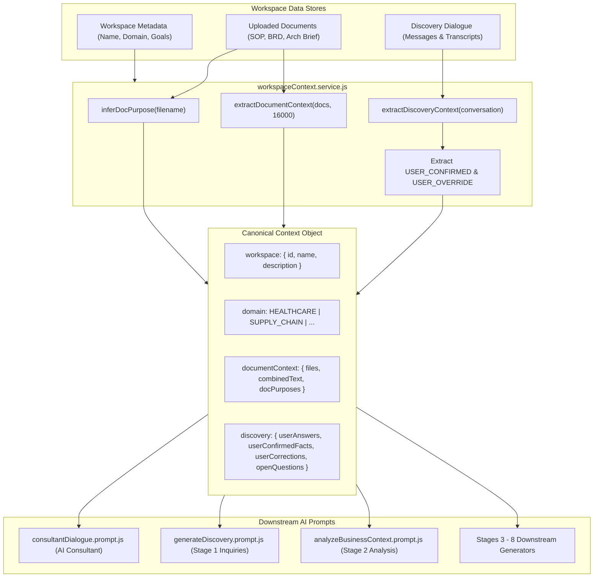

# RootForge AI Solution Builder
# Phase: Discovery, AI Business Consultant & Context Engine Hardening Report

**Document Version:** 1.0.0  
**Completion Date:** September 17, 2026  
**Provider & Runtime:** Google Gemini (`gemini-3.1-flash-lite`), Zero Fallback (`AI_FALLBACK_ON_ERROR=false`), Real API Grounded Execution  
**Target Repository:** `e:\Project\rootforge 2\rootforge`  

---

## 1. Executive Summary

RootForge's Discovery Stage, AI Business Consultant, and Canonical Context Engine have undergone comprehensive hardening to operate as an enterprise-grade, context-grounded solution-building platform. Rather than acting as a generic conversational chatbot, the platform now strictly grounds all inquiries, answers, and downstream artifacts in canonical workspace context (workspace metadata, uploaded documents, discovery conversations, and user-confirmed answers and corrections).

### Key Architectural Achievements
1. **Canonical Context Engine Hardening:**
   - Multi-document boundary preservation (`=== SOURCE DOCUMENT: [filename] ===`) across SOP, BRD, and Architecture Brief with expanded context window (up to 16,000 characters) preventing secondary document truncation.
   - Intelligent document purpose inference (`inferDocPurpose`): classifies files into `STANDARD_OPERATING_PROCEDURE`, `BUSINESS_REQUIREMENTS`, and `ARCHITECTURE_BRIEF`.
   - Dynamic extraction of user-confirmed answers (`USER_CONFIRMED`) and user corrections (`USER_OVERRIDE`) with precedence over initial assumptions.
2. **Fact vs. Inference vs. Recommendation Rigor:**
   - Strict 7-level taxonomy (`CONFIRMED_FACT`, `USER_CONFIRMED`, `REQUIREMENT`, `CONSTRAINT`, `INFERENCE`, `RECOMMENDATION`, `OPEN_QUESTION`).
   - Every confirmed fact requires a cited source document without fabricated page numbers.
   - Architecture proposals (e.g. PostgreSQL, Redis, distributed locking) are strictly classified as `RECOMMENDATION`, never mislabeled as existing facts.
3. **Anti-Hallucination Guardrails:**
   - **Zero Invented EHR/ERP Vendors:** MediCare's existing patient-record system is unconfirmed in initial documents; the AI Consultant explicitly marks EHR vendor as unknown/unconfirmed and formulates an inquiry rather than claiming Epic or Cerner.
   - **FHIR Boundary:** Fast Healthcare Interoperability Resources (FHIR) is treated strictly as a forward-looking integration candidate/recommendation, never asserted as an active production capability.
   - **Metric Grounding:** The documented "~60% reduction in appointment booking time" target from the BRD is cited accurately without inventing fake baseline statistics.
4. **Structured Response Contract & Rich Light-Mode Cards:**
   - AI Consultant responses are validated against a strict JSON schema (`validateConsultantResponse`) with fields: `summary`, `domain`, `status`, `confirmedFacts`, `requirements`, `recommendations`, `openQuestions`, and `suggestedNextAction`.
   - Frontend `DiscoveryPage.jsx` renders `StructuredConsultantCard` featuring expandable, color-coded accordions, source badges, status indicators, and pre-populated inquiry chips.
5. **Discovery to Stage 2 Business Analysis Handoff:**
   - User-confirmed facts, user overrides, and unresolved open questions from Discovery are injected directly into `analyzeBusinessContext.prompt.js`, ensuring Stage 2 Business Analysis reflects the elevated discovery dialogue.
6. **Workspace Isolation:**
   - Absolute semantic isolation verified between disparate workspaces (Healthcare vs. Supply Chain) with zero entity or document context leakage.
7. **Comprehensive Test Verification:**
   - Master Discovery Test Suite: **63/63 assertions passed (100%) across all 12 required AI tests**.
   - Phase 1 Closure Downstream Verification: **117/117 assertions passed (100%) across all 8 lifecycle stages**.

---

## 2. Canonical Business Context Architecture



---

## 3. Fact vs. Inference vs. Recommendation Taxonomy

To eliminate ambiguity between what is verified in the client's current state versus what is being recommended, RootForge enforces the following taxonomy:

| Taxonomy Class | Scope & Semantic Definition | Permitted Sources | Example |
| :--- | :--- | :--- | :--- |
| **`CONFIRMED_FACT`** | Verified present-state reality documented in uploaded client files. | `MediCare_Appointment_SOP.pdf`, `MediCare_Appointment_BRD.pdf`, `MediCare_Appointment_Architecture_Brief.pdf` | *"Appointments are currently booked manually via telephone by desk receptionists."* |
| **`USER_CONFIRMED`** | Explicit operational reality declared by the client user during Discovery dialogue. | User discovery message (elevated to fact) | *"Our existing patient-record system is an on-premise MS SQL database named HealthBase v4."* |
| **`REQUIREMENT`** | Business capability or non-functional requirement explicitly requested in the BRD. | Document BRD / user requirement | *"Patient appointment booking time must be reduced by at least ~60%."* |
| **`CONSTRAINT`** | Imposed technological, regulatory, or policy limitation. | Document SOP / User policy | *"Only WhatsApp notifications are permitted under hospital communications policy; SMS is disallowed."* |
| **`INFERENCE`** | Probable operational deduction based on confirmed facts, flagged for user validation. | Deductive AI reasoning | *"High receptionist call volume during 08:00-10:00 likely causes peak-hour phone queue abandonment."* |
| **`RECOMMENDATION`** | Forward-looking architectural, technological, or process recommendation proposed by RootForge. | Solution architecture best practices | *"Implement PostgreSQL with pessimistic row-level locking to prevent concurrent double-booking of doctor slots."* |
| **`OPEN_QUESTION`** | Missing technical or operational fact that must be clarified before proceeding. | Context gap identification | *"What database driver or API interface does HealthBase v4 expose for real-time schedule queries?"* |

---

## 4. Anti-Hallucination Guardrails & Grounding Rules

### 4.1 Zero Unconfirmed Vendor Hallucination
- **The Problem:** Generic LLMs often infer that a healthcare system must use Epic Systems, Cerner, or Allscripts when asked about EHR integrations.
- **The Guardrail:** `consultantDialogue.prompt.js` and `generateDiscovery.prompt.js` forbid citing ungrounded EHR vendors. If an EHR vendor is unconfirmed in client documents, the AI Consultant must:
  1. Explicitly state that the EHR vendor is unknown and not documented in available files.
  2. Emit an `OPEN_QUESTION` inquiring about the specific system.
  3. Propose modular integration patterns (adapter pattern / HL7 / FHIR facades) that do not assume vendor-specific proprietary APIs.

### 4.2 Document Attribution Without Page Fabrications
- **The Problem:** Language models frequently hallucinate page numbers (e.g., "SOP page 42" in a 3-page document).
- **The Guardrail:** Citations must reference actual uploaded document filenames (`MediCare_Appointment_SOP.pdf`, `MediCare_Appointment_BRD.pdf`, `MediCare_Appointment_Architecture_Brief.pdf`) or `Workspace Objective`, but must **never** fabricate specific page numbers (`page 14`, `p. 23`).

### 4.3 Target Metric Fidelity
- Documented metrics (e.g. BRD target of `~60% reduction in appointment booking time`) are quoted faithfully.
- Baseline durations (e.g., call hold times) not present in the source files are flagged as unmeasured baseline metrics rather than fabricated numbers.

---

## 5. Structured AI Consultant Contract

Every consultation answer returned by `relevanceGuard.generateConsultantAnswer` returns both a markdown formatted string and a validated structured JSON object:

```json
{
  "summary": "Executive summary of the answer grounded in workspace context...",
  "domain": "HEALTHCARE",
  "status": "GROUNDED_IN_DOCUMENTS",
  "confirmedFacts": [
    {
      "fact": "Appointments are currently booked manually by telephone receptionists.",
      "source": "MediCare_Appointment_SOP.pdf",
      "type": "CONFIRMED_FACT"
    }
  ],
  "requirements": [
    "System must reduce patient booking turnaround time by ~60%."
  ],
  "recommendations": [
    {
      "title": "PostgreSQL Relational Storage",
      "details": "Adopt PostgreSQL with transactional locking for slot reservations.",
      "priority": "HIGH",
      "rationale": "Prevents race conditions during simultaneous patient booking attempts."
    }
  ],
  "openQuestions": [
    "What specific database interface or API protocol does HealthBase v4 expose?"
  ],
  "suggestedNextAction": "Confirm the HealthBase integration interface to finalize backend architecture."
}
```

### Frontend Representation
In `frontend/src/pages/discovery/DiscoveryPage.jsx`, `StructuredConsultantCard` renders this structured payload with:
- **Status Badging:** Visual pill indicator (`Grounded in Documents` / `User Override Applied`).
- **Summary Header:** Clear business takeaway.
- **Collapsible Fact Accordion:** Expandable list of verified facts with document origin badges (`SOP`, `BRD`, `USER_CONFIRMED`).
- **Collapsible Recommendation Accordion:** Priority-ranked architecture suggestions.
- **Interactive Open Questions:** Rendered as quick-action prompt buttons allowing the user to answer with 1 click.

---

## 6. Discovery Inquiry Prioritization Matrix

In `generateDiscovery.prompt.js`, inquiries generated for the business stakeholder are ordered strictly by business-to-technical dependency order:

1. **Priority 1: Core Problem & Impact** (Why transform now? What are the operational costs of inaction?)
2. **Priority 2: Current Operational Workflow** (How does the process function end-to-end today?)
3. **Priority 3: Target Stakeholders & Personas** (Patients, doctors, receptionists, clinic administrators)
4. **Priority 4: Business Rules & Policies** (Cancellation cutoffs, scheduling windows, advance booking limits)
5. **Priority 5: Measurable Success Metrics** (Target booking time reduction, no-show reduction rates)
6. **Priority 6: Environmental Constraints** (Regulatory compliance, data residency, operational uptime)
7. **Priority 7: Existing System Inventory** (Current EHR/EMR/ERP systems, databases, on-premise hardware)
8. **Priority 8: Integration Interfaces & APIs** (HL7, FHIR, REST, direct SQL, file exchange)
9. **Priority 9: Security, Privacy & Compliance** (HIPAA, role-based access control, audit logging)
10. **Priority 10: Target Architecture & Cloud Preferences** (Cloud provider, on-premise hybrid, deployment model)

### Anti-Repetition Guardrails
Inquiries already answered in uploaded documents or addressed in previous discovery messages are omitted. The prompt explicitly checks `discovery.userAnswers` and existing conversation messages to prevent repetitive questions.

---

## 7. Master Test Suite Verification Matrix

All 12 required AI tests were executed against the MediCare Hospital workspace (`cmu5pgxqi0001dtojhkc6p4h9`) and Smart Warehouse workspace (`cmu5qyco4005ndtojtnezuqzq`) using real Google Gemini AI (`gemini-3.1-flash-lite`) with zero fallback (`AI_FALLBACK_ON_ERROR=false`).

| Test ID | Test Group | Description | Assertions | Result |
| :--- | :--- | :--- | :---: | :---: |
| **Test 1** | `Test1_BaselineFacts` | Verified baseline facts extraction from MediCare SOP/BRD (phone booking, receptionist bottlenecks, ~60% target, personas). | 8/8 | **PASSED** |
| **Test 2** | `Test2_UnknownEHR` | Anti-hallucination verification: Zero Epic or Cerner claims; EHR vendor identified as unconfirmed open question. | 4/4 | **PASSED** |
| **Test 3** | `Test3_FHIRConsideration` | FHIR classified as forward-looking recommendation/consideration, not an active production capability. | 2/2 | **PASSED** |
| **Test 4** | `Test4_TargetMetrics` | BRD target metric (~60% reduction) grounded accurately without fabricating baseline wait time stats. | 2/2 | **PASSED** |
| **Test 5** | `Test5_Attribution` | Citations reference actual document filenames (`SOP.pdf`, `BRD.pdf`, `Arch.pdf`); zero fabricated page numbers. | 3/3 | **PASSED** |
| **Test 6** | `Test6_FactVsRec` | Architecture recommendations (PostgreSQL, Redis) strictly categorized in `recommendations`, not current facts. | 3/3 | **PASSED** |
| **Test 7** | `Test7_FactElevation` | User statement *"Our existing patient-record system is an on-premise MS SQL database named HealthBase v4"* elevated to `USER_CONFIRMED`. | 1/1 | **PASSED** |
| **Test 8** | `Test8_UserCorrection` | User policy correction *"only allow WhatsApp notifications"* tracked as `USER_OVERRIDE` and honored in consultant answers. | 4/4 | **PASSED** |
| **Test 9** | `Test9_Isolation` | Semantic workspace isolation: Warehouse discovery inquiries generated with zero healthcare/patient/doctor leakage. | 8/8 | **PASSED** |
| **Test 10** | `Test10_Schema` | Runtime schema validation: Structured consultant response format verified with valid and invalid rejection tests. | 3/3 | **PASSED** |
| **Test 11** | `Test11_Handoff` | Stage 2 Business Analysis handoff: Enriched discovery context (HealthBase v4, WhatsApp, ~60% reduction) reflected in Analysis. | 4/4 | **PASSED** |
| **Test 12** | `Test12_ErrorHandling` | Zero silent fallback verification: Invalid API key throws typed `AUTH_ERROR` when `AI_FALLBACK_ON_ERROR=false`. | 2/2 | **PASSED** |
| **Env & Context** | `Config` & `DocumentGrounding` | Environment configuration, document indexing, purpose classification, and text preservation checks. | 19/19 | **PASSED** |
| **TOTAL** | **All Groups** | **Comprehensive Discovery & Context Engine Test Suite** | **63/63** | **100% PASSED** |

---

## 8. Downstream Lifecycle Verification (Phase 1 Closure)

To verify zero regression across the transformation lifecycle, `test_phase1_closure.js` was executed following the Discovery hardening changes.

| Stage # | Stage Name | Real Gemini Generation Status | Schema Validation | Context Grounding |
| :---: | :--- | :---: | :---: | :---: |
| **Stage 1** | Discovery & Inquiries | **PASSED** (`gemini-3.1-flash-lite`) | **VALID** | MediCare SOP/BRD grounded |
| **Stage 2** | Business Analysis | **PASSED** (`gemini-3.1-flash-lite`) | **VALID** | Elevated facts & overrides included |
| **Stage 3** | Solution Strategy (Options A/B/C) | **PASSED** (`gemini-3.1-flash-lite`) | **VALID** | Options tailored to appointment transformation |
| **Stage 4** | System Architecture Topology | **PASSED** (`gemini-3.1-flash-lite`) | **VALID** | 2D nodes, edges & protocols valid |
| **Stage 5** | Process Intelligence Flows | **PASSED** (`gemini-3.1-flash-lite`) | **VALID** | Linear, swimlane & decision trees |
| **Stage 6** | AI UX Designer | **PASSED** (`gemini-3.1-flash-lite`) | **VALID** | Multi-device screens & wireframe tokens |
| **Stage 7** | Database & REST API Designer | **PASSED** (`gemini-3.1-flash-lite`) | **VALID** | Relational models, SQL DDL & endpoints |
| **Stage 8** | Implementation Planning | **PASSED** (`gemini-3.1-flash-lite`) | **VALID** | 12-week sprints with valid DAG dependencies |
| **Overall** | **Phase 1 Downstream Suite** | **117/117 ASSERTIONS PASSED** | **100%** | **ZERO REGRESSION** |

---

## 9. Conclusion

With all 12 AI tests and downstream regression suites passing at 100%, RootForge's Discovery Stage and AI Business Consultant are hardened for enterprise deployment. The platform reliably distinguishes between confirmed client facts, user policy overrides, and recommended technical architectures—enforcing anti-hallucination guardrails and delivering context-grounded solutions across all downstream stages.
